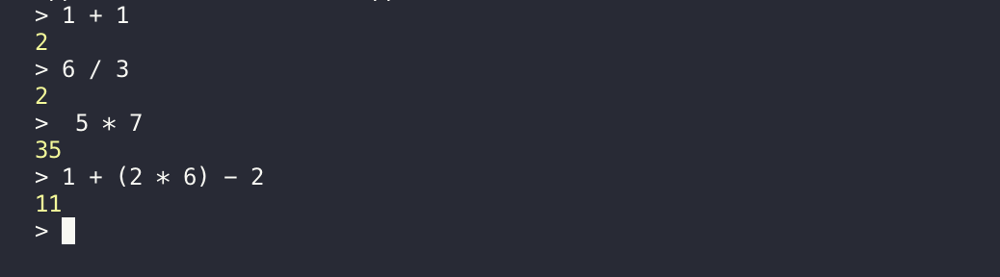
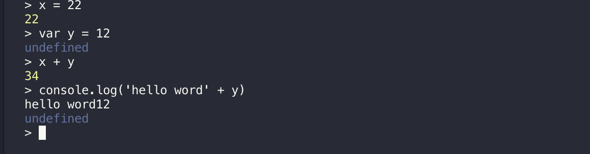
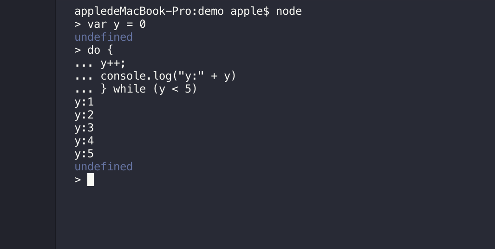
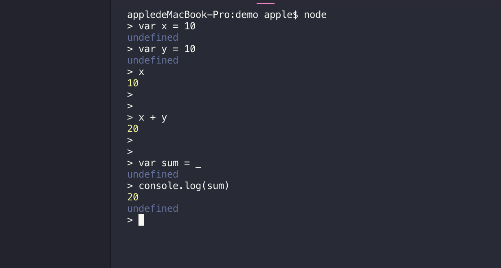

####输入node命令启动node终端

`node`

####简单的表达式运算

#### 使用变量

######你可以将关键字存储在变量中，在需要的时候再使用它
1.变量声明要使用var关键字， 如果不使用var关键字 比那辆会直接打印出来
2.使用var关键字可以使用console.log()来输入变量

#### 多行表达式

#### 下划线(_)变量

######可以使用下划线获取上一个表达式的运算结果

## REPL

#### ctrl + c - 退出当前终端。

#### ctrl + c 按下两次 - 退出 Node REPL。

#### ctrl + d - 退出 Node REPL.

#### 向上/向下 键 - 查看输入的历史命令

#### tab 键 - 列出当前命令

#### .help - 列出使用命令

#### .break - 退出多行表达式

#### .clear - 退出多行表达式

#### .save filename - 保存当前的 Node REPL 会话到指定文件

#### .load filename - 载入当前 Node REPL 会话的文件内容。